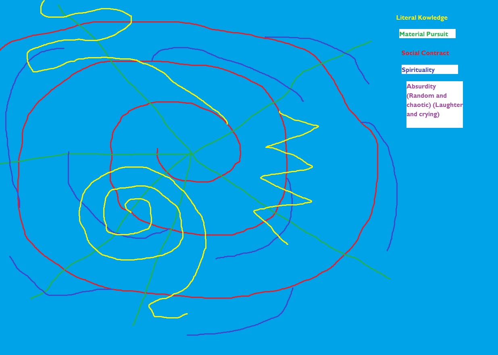

# Meta4
 Game of the abstract

A fairly simple 2D game in Unity. It's a metaphor for life. There is no great measure of how well you did, but there are measures: money, or popularity, or length of the game. However they are necessarily a measure of success - it depends on what metric you believe to be important.

Thought about different "states" of play that can switch depending on player's choice/input throughout:
Spiritual, Literal, Deconstructive, Abstract, Absurd, Social, Material.

Material and Literal are a pair, but money and knowledge are the respective metrics.

Abstract and Absurd are paired, but abstract sees all paths but in just shapes that are randomly but consistently used through the state. Absurd sees everything constantly shifts/changing perspective.

Deconstructive sees code? No metric.

Social has several metrics but has no control.

Movement: Background moves from down to up on screen. The player can certainly move forward (down screen) quicker, but can only slow and stop the flow for seconds every so ofte (ever minute maybe). Player can freely move left and right on screen. (Or to make things trickier for programming - it could involve several different paths to take, but the camera will take a different fork depending on player's choice. .)

There will be paths on the screen that give gradual upticks in metrics as a player moves over it. There will also be installations, institutions, and fixtures that provide windfall chunks, but payouts are still randomized to some extent.
(e.g. house of worship, home, jobs, schools, mentors)

Which means metric at this point is: Money, Skill/Knowledge, Cache. Longevity is a metric, but counted differently.
